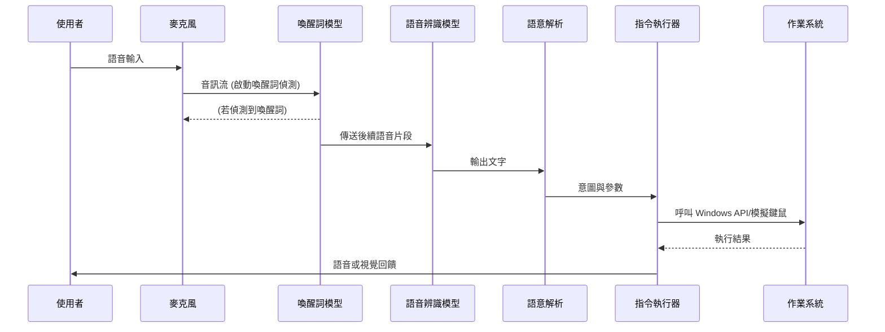

# ChatGPT 深度研究報告 — 本地離線語音助理方案

# 執行摘要  
本報告針對「本地電腦離線語音助理」方案進行全面性分析，涵蓋語音辨識、語意理解、喚醒詞檢測等模型選擇與比較，以及硬體需求、系統整合、資安與隱私防護等面向。透過匯整最新研究與開放/商業解決方案，我們發現多款**可離線運行**的中文語音辨識模型（如 Vosk、OpenAI Whisper、SenseVoice 等）與喚醒詞系統（Picovoice Porcupine、Mycroft Precise 等），可在各類桌機環境下達成即時辨識。報告建議以 Windows 10/11 為主要平台（針對 macOS/Linux 做差異化註解），並利用如 AutoHotkey（Windows）或 xdotool（Linux）等模擬鍵鼠工具實現系統控制。在硬體方面，從入門級 PC（如 i5/8GB/無獨顯）到高效能伺服器級（如 i9/32GB/RTX 4080），皆可因應不同模型負載，實現整體回應延遲在數百毫秒內（較小型模型可達 6× 實時效能）。  

系統整合方面，我們規劃了從音頻前處理、喚醒詞偵測到語意解析及動作執行的完整流水線。安全與隱私層面則採取本地化資料儲存、最小權限執行和命令白名單等策略，並以用戶聲紋或 PIN 作雙重認證。建置 SOP 以表格方式列出每步指令與預期結果（見附表），並提供錯誤排除說明。測試計畫涵蓋功能正確性、延遲/效能指標與抗噪音壓力測試。維運策略則建議定期更新模型（可透過外部儲存裝置離線升級）、備份離線資料及建立故障回復程序。附錄中提供關鍵流程的 Python 範例程式碼片段與 Mermaid 架構圖，以利讀者直觀理解系統架構。

## 目標與範圍  
本方案目標是在**完全離線**的前提下，在本地 Windows 10/11 桌機上實現語音助理功能，能夠聆聽使用者語音指令，解析意圖，並控制桌面所有功能（如開啟/關閉程式、模擬鍵鼠操作、修改系統設定、執行檔案管理操作等）。即使網路介面處於斷線狀態，也須可變更網路設定（如設定靜態 IP、管理網路介面）。若未指定平台，預設以 Windows 10/11 為目標環境；若需支援 macOS/Linux，則分別採用 AppleScript/Automator 或 X Window System (xdotool、dbus) 等工具來替代 Windows API。Windows 下建議使用 PowerShell 或 Win32 API 進行程式啟動與設定變更；macOS 可用 `osascript` 呼叫 AppleScript 指令；Linux 可用 `xdotool`、`dbus-send` 等來模擬鍵鼠與系統呼叫。系統僅需標準使用者權限即可運行；若需修改全域系統設定（如網路、系統設定），可考慮使用 UAC 或 sudo 提示。

## 模型選擇  

- **語音辨識（ASR）模型：**  

  1. **Vosk (Kaldi-based)**：開源免費、支援中文。具有「小模型」與「大模型」可選，小模型 (~42MB) 適合資源受限裝置，大模型 (~1.3GB) 提供最高準確度。依據官方數據，大模型在 AISHELL、THCHS 等中文語料上 WER 可低至 7–17%；在樹莓派 4B 上測試時，中文辨識準確率約 92%，延遲控制在 150ms 以內。Vosk 採 Apache 2.0 授權，可動態載入詞彙表，易於二次開發。資源需求方面，小模型僅需約 300MB RAM；大模型則需數 GB RAM 和較快 CPU (建議 Intel i7 級以上)。

  2. **OpenAI Whisper 系列**：多語言大型 Transformer 模型（MIT 授權）。Whisper 提供多種規模（tiny 到 large-v3，共數億到十億參數），可離線運行。準確度極高：large-v3 在乾淨語音上的 WER 約 2–3%；但需較高運算資源。例如在 NVIDIA RTX 4070 GPU 上，Whisper large-v3 可達 ~12× 實時推理速率；在一般現代 CPU（無 GPU）上，Whisper small (~3.4% WER) 可達 ~6× 實時。另外，針對中文和東亞語系，專門化模型如 SenseVoice（開放源碼）可大幅提升速度與標點處理能力。總體而言，Whisper 系列模型提供最廣語言支持，但需根據硬體條件選擇適當尺寸（建議在無 GPU 時以 tiny/base 為主，在具備 GPU 時可考慮 small/medium/large-v3）。

  3. **SenseVoice (FunASR)**：商用公司提供的開源「多語言語音基礎模型」，針對中文、粵語優化。SenseVoiceSmall 使用非自回歸結構，推理速度極快；官方基準測試顯示對比 WhisperSmall，其推理速度超過 5 倍，在中文辨識準確度上也具優勢。此模型透過 FunASR (類似 huggingface API) 部署，支援 CUDA 加速與 CPU 推理，並可自由調整批次大小與 VAD。其參數量適中（數百萬級），推理時延遠低於 WhisperLarge，適合實時需求。授權為 Apache 2.0，可商用且有活躍更新。

  4. **Mozilla DeepSpeech / PaddleSpeech / Kaldi 等：**  
     - *DeepSpeech（TensorFlow-based）*：有中文模型，可達 95% 以上準確度。模型約 1.2GB，需 NVIDIA GPU 加速以達實時；CPU 推理較慢。對於高效能設備是一選擇。  
     - *Kaldi 開源模型*：可自行訓練或使用現成中文模型 (如 AISHELL-1, THCHS-30)。靈活但實作門檻高。  
     - *科大訊飛*：中國商用語音引擎領導者，提供離線 SDK（需商業授權）。準確度業界頂尖，對口音和專業詞彙支持很好。但非開源，成本與授權限制需注意。  

- **語意理解/指令解析 (NLU/Intent) 模型：**  

  對於桌面控制型語音助理，NLU 模型通常不需大規模語言模型，可採用意圖分類與關鍵字提取的方式。開源選項包括：  
  - *Rasa NLU*：Python 平台，支援自訂中文語料，可離線運行（Apache 2.0 授權）。需要提供訓練集 (例：意圖範例句) 以分類指令。對於桌面自動化場景，可將常用指令如「打開 X 程式」、「調整音量」等對應到意圖標籤。  
  - *Snips NLU*：原為 Hermès 計畫，後被 Sonos 收購，目前較少更新。支持離線部署，多為關鍵字或規則匹配。  
  - *本地 LLM*：近期出現如 Qwen、ChatGPT 類模型可微調為離線多功能代理（需強大硬體）。此方案複雜度高，在無網路環境下實現成本極高，不建議初期採用。  
  因此，本方案可優先選用 Rasa 或自訂規則，結合文本分類與關鍵字提取（例如 Python 的 jieba 斷詞、Sklearn 分類器），以達到快速辨識指令意圖及參數。

- **喚醒詞（Wake Word）模型：**  

  必須先辨識使用者喚醒詞才進行後續 ASR。可用的離線方案：  
  - *Picovoice Porcupine*：商業級引擎，支援定製喚醒詞，CPU 使用率極低 (<5%)。需申請免費或商用許可，但個人專案有免費選項。誤喚醒率低，適合長時間運行。  
  - *Mycroft Precise*：完全開源的喚醒詞系統，可動態調整檢測閾值，適合需深入客製化的場景。訓練需自行收集正樣本。  
  - *Snowboy*：曾流行的開源方案，目前已停止維護。訓練一個喚醒詞需 ~200 條聲音範例；在安靜環境下誤喚醒率 <0.1%。由於停止更新，僅適作學術或備援用途。  
  - *TensorFlow Lite 模型*：可透過網上開源資料自行訓練便攜式模型，或使用第三方如 Qualcomm 的 wake-word 模型。  

  以上喚醒詞引擎大都可在 CPU 上實時運行，模型文件小（十幾 MB），搭配 VAD (Voice Activity Detection) 即可構建穩定的喚醒系統。建議實作一個雙級喚醒策略：首先透過常駐喚醒詞引擎偵測，喚醒後再進行完整語音識別。

- **模型比較表（部分模型示例）：**

  | 模型            | 類型    | 語言支援    | 主要特點                                 | 中文準確率/WER         | 延遲/RTF            | 資源需求                 | 授權       |
  | --------------- | ------- | --------- | ---------------------------------------- | ------------------- | ---------------- | ---------------------- | ---------- |
  | Vosk 小型       | ASR     | 多語言 (含中) | 輕量、動態詞庫                          | THCHS WER ~17% | RPi4 ~0.15s延遲 | RAM≈300MB, 可CPU運算        | Apache 2.0 |
  | Vosk 大型       | ASR     | 多語言 (含中) | 高準確性                                 | THCHS WER ~7%  | i7 CPU 可即時         | RAM需達數GB, 高效CPU      | Apache 2.0 |
  | Whisper Small   | ASR     | 100+語言    | 開源多語言Transformer                  | WER ~3.4% (英) | CPU ~6×實時   | RAM≈2GB，可CPU運行         | MIT        |
  | Whisper Large-v3| ASR     | 100+語言    | 極高準確率 (多語種)                     | WER ~2.5% (英)  | GPU ~12×實時  | RAM≈10GB，建議GPU (RTX 40系) | MIT        |
  | SenseVoice Small| ASR     | 中、粵、英... | 非自回歸低延遲、多項能力 (ASR+情感+...) | 中英文優於Whisper| ≫ Whisper 小型 (5×速度) | CUDA/CPU 支援 (FunASR)  | Apache 2.0 |
  | DeepSpeech (中文)| ASR    | 中文        | 終端到端語音識別                         | ~95% 准確率      | 需NVIDIA GPU實時       | 模型 ~1.2GB, GPU加速      | MPL 2.0    |
  | iFlytek 離線    | ASR     | 中、英、日... | 業界準確率最高 (封閉商業)               | 業界領先 (超過95%)           | 低延遲 (企業級)        | 專屬硬體/SDK              | 商用 (不公開) |
  | Porcupine       | 喚醒詞  | 多語言 (含中) | 穩定高效、可客製化喚醒詞               | n/a (誤喚醒率<0.1%) | CPU佔用<5%   | 文件 ~1MB, CPU輕量         | 商用 (免費用於開發) |
  | Precise         | 喚醒詞  | 多語言      | 開源，可動態閾值                         | n/a                     | 靈活調整             | RAM低, Python 運行       | Apache 2.0 |
  | Snowboy         | 喚醒詞  | 英文/中文   | 已停更，需自訓練                         | 誤喚醒率<0.1% | 輕量CPU             | 約 5MB, Python/TFLite    | Apache 2.0 |

  *說明：WER 表示詞錯誤率，RTF 為實時因子 (Real-Time Factor；越大表示處理越快)。各模型準確率視語料與環境而異。*

## 硬體需求  

系統需滿足即時回應需求，建議依不同規模配置：

| 級別   | CPU                         | RAM   | GPU            | 儲存空間       | 麥克風/音訊介面   | 預估效能 (RTF/延遲)             | 備註             |
| ------ | --------------------------- | ----- | -------------- | ------------ | --------------- | ----------------------------- | ---------------- |
| 輕量級 | Intel Core i3/i5 四核心    | 8GB  | 無獨立 GPU (內顯) | 50GB SSD      | 一般桌上型麥克風   | Vosk 小模型可即時處理；Whisper tiny/base RTF ~5–6×（1秒音頻處理0.17s左右） | 適合簡單語音指令；背景噪音抑制差 |
| 一般桌機 | Intel Core i5/i7 六八核心 | 16GB | NVIDIA GTX 1660/RTX 3060 (6GB) | 100GB SSD    | 陣列式USB麥克風（支援降噪） | Whisper small/base 可達6×實時；Vosk大模型延遲 <0.1s；系統執行命令延遲可控於幾百毫秒 | 較強的 NLP 與 ASR 處理能力 |
| 高效能 | Intel Core i9/AMD Ryzen 9 八核心以上 | 32GB+ | NVIDIA RTX 4080/4090 (16–24GB) | 1TB SSD      | 專業降噪陣列麥克風（如 8 鍵麥克風陣列） | Whisper large-v3 在 RTX4070 可達 ~12×實時；SenseVoiceSmall 超過 WhisperSmall 5倍速度。整體指令延遲可縮至 <100ms | 可同時支持多任務並行處理，適用企業級部署 |

*說明：RTF（實時因子）表示模型處理的速度：高於1×表示超越實時。在相同硬體上，Whisper_large-v3 **需** GPU 才能在合理延遲內運行。Vosk 系列對 CPU 親和力高，即使在低功耗平台也可運行；SenseVoice 於 GPU 上具有更佳效能。*

此外，建議預留適當 I/O 資源：USB 音效卡或 PCIe 聲卡，以確保高品質輸入；SSD 儲存可降低模型載入與資料存取延遲。若採用深度學習模型運行（如 Whisper），GPU VRAM 要求視模型大小而定（Whisper small 約需 2GB，large-v3 ~10GB）。為降低延遲，可考慮使用量化模型（如 INT8 或 16-bit）以減少運算負擔。

## 系統整合  

整體架構包括音訊前處理、喚醒詞偵測、語音辨識、語意解析與系統控制等模組，其流程圖如下所示：  

```mermaid
flowchart LR
    subgraph "使用者與麥克風"
        Mic[麥克風收音] --> Pre[前端處理: 降噪/回聲消除/VAD]
    end
    Pre --> Wake[喚醒詞檢測 (Porcupine/Precise)]
    Wake -- 喚醒成功 --> ASR[ASR語音辨識 (Vosk/Whisper/SenseVoice)]
    ASR --> NLU[語意理解/意圖解析 (Rasa/自訂規則)]
    NLU --> Exec[指令執行器 (模擬鍵鼠/API呼叫)]
    Exec --> OS[作業系統 (Windows API/AutoHotkey)]
    OS --> Feedback[反饋 (語音回應或視覺提示)]
    Feedback --> User[使用者]
```

- **音訊前處理：** 從麥克風獲取原始音訊（建議採樣率 16kHz、16-bit），可先做預加重、回聲消除與噪音抑制。使用 VAD（Voice Activity Detection）分段音訊，只在有語音時送入後續模組，降低空閒時延遲與負載。  

- **喚醒詞偵測：** 持續監聽喚醒詞模型（如 Porcupine）。使用者說出喚醒詞時，喚醒詞引擎回傳觸發訊號，才啟動後續完整辨識流程；可有效節省運算資源。系統可執行低功耗等待模式，並在喚醒時記錄後續語音片段進行辨識。此階段錯誤喚醒率需嚴格控制，可透過動態調整敏感度參數。  

- **語音辨識 (ASR)：** 喚醒後，立即將語音片段送入 ASR 引擎（如 Vosk 或 Whisper）。ASR 返回文本結果後，再交給 NLU 解析。在 Windows 平台，可結合 PyAudio/PortAudio 接口來串流音訊，使用 KaldiRecognizer 或 Whisper-CPP 等工具執行。  

- **語意理解 (NLU)：** 將 ASR 文本輸入意圖分類器（例如 Rasa NLU）。可自訂意圖 (intents) 如「打開程式」、「關閉視窗」、「調高音量」等，並擷取實體參數（如程式名、數值）。如果採用簡易方案，可用關鍵字或正則表達式直接識別指令。NLU 模組的輸出為意圖和槽位參數。  

- **指令執行：** 根據辨識出的意圖，透過作業系統 API 或第三方工具執行對應操作。例如：「打開瀏覽器」可呼叫 `ShellExecute("chrome.exe")` 或使用 AutoHotkey 發出 `Win+R` → 輸入 `chrome` → Enter；「模擬滑鼠左鍵點擊」可使用 `SendInput` 或 PyAutoGUI。執行重要系統設定（網路、音量）時，需取得對應權限（Windows 可使用 COM 或 PowerShell 指令）。完成命令後，可選擇以 TTS (e.g. eSpeak、Windows SAPI) 或視覺訊息反饋結果。  

- **靜音/噪音處理：** 可引入 WebRTC 的降噪、RNNoise 開源庫等做實時降噪，或使用硬體回聲消除 (AEC) 的麥克風陣列。設定自動增益控制 (AGC) 保持音量平穩。喚醒詞後可強制靜默段落，如使用 Voice Activity Detection 偵測語音結束。  

- **系統服務/守護：** 將語音助理程式配置為常駐服務，例如在 Windows 上建立 Windows Service (可用 NSSM 工具)，或放入排程任務。服務需多緒執行：喚醒詞偵測常駐等待緒，ASR 辨識與 NLU 解析交由工作緒完成，並使用 Queue 進行訊息傳遞。需實作錯誤回復機制，如喚醒詞或 ASR 模組異常時自動重啟。記錄日誌 (包含音訊截圖、辨識結果、執行命令等) 以供後續審計。  

完整的處理流程可簡化為：  
「音頻採集 → 预加重滤波 → 端点检测 → 唤醒词检测 → 语音识别 → 意图解析 → 执行反馈」。此流程可作為系統開發的參考藍本。

## 安全與隱私  

離線語音助理具有固有的隱私優勢（資料全留在本地），但仍需注意安全與合規：  

- **本地資料儲存：** 所有錄音、識別結果與日誌都應留存在本地機器或局域網內部系統，避免上傳雲端。敏感資料如用戶配置、語料庫應加密保存。遵守地方法規（如GDPR或中國《個人信息保護法》）要求，無授權不對外泄露語音數據。  

- **最小權限原則：** 語音助理服務僅使用標準使用者權限運行，不隨意提權為系統管理員。執行系統設定命令時可彈出提示框要求用戶確認。盡量避免以程式方式執行任意腳本或下載程式；對於固定指令集合採取白名單策略。  

- **防止任意程式執行：** 僅允許可控命令與可預期參數，避免用戶語音中注入惡意程式名稱。建議對可能的命令和程式列表做嚴格檢查，或對於自定義詞彙嚴格過濾。  

- **使用者認證：** 若設備多人共用，可增加聲紋辨識或 PIN 二次認證。聲紋辨識（speaker verification）可選用 Kaldi 或深度學習模型在本地識別已註冊用戶，以免他人無聲紋授權而操作。PIN 輸入可作為後備。  

- **日誌與稽核：** 保留操作記錄，包括命令內容、執行時間、辨識結果、系統回應等，並定期檢查異常模式。可將日誌輪轉與備份。若系統崩潰或被意外關閉，記錄崩潰前最後幾行日誌以便除錯。  

- **安全更新與隔離：** 定期更新依賴庫和模型以修補已知漏洞。若使用第三方 SDK（如 Porcupine），關注其安全公告。建議在虛擬環境 (Python venv) 或 Docker 容器中隔離運行，減少對主系統的衝擊。

## 建置 SOP  

以下以 Windows 環境示例，展示建置流程步驟、命令範例、預期輸出與常見錯誤解法：  

| 步驟 | 操作指令範例                                  | 預期輸出               | 常見錯誤與排除方法                                                               |
| ---- | ------------------------------------------- | ------------------- | ------------------------------------------------------------------------- |
| 1. 安裝 Python 環境   | `choco install python` 或至官網下載安裝   | Python 3.x 安裝完成      | 若無法執行 `python`，請確認 PATH 已加入環境變數。                                      |
| 2. 建立虛擬環境 (可選) | `python -m venv venv` <br>`venv\Scripts\activate` | 進入虛擬環境 `(.venv)`      | 無虛擬環境時，須將套件安裝於全域。確保使用對應 Python 版本。                                 |
| 3. 安裝依賴套件      | `pip install vosk pywin32 pyaudio pyautogui`  | 套件安裝成功提示           | 若 `pyaudio` 安裝失敗，可先安裝端口音訊驅動。 |
| 4. 下載語音辨識模型   | 下載 Vosk 中文模型並解壓縮 | 解壓出 models/vosk-model-cn | 若網路無法直接下載，請使用其他可聯網電腦下載後透過 USB 複製。                              |
| 5. 下載喚醒詞模型     | 自 Porcupine 官網或 Mycroft repo 下載 `.ppn` 模型文件 | 取得對應語言 `.ppn` 檔      | 確保模型與程式庫版本匹配，放於指定目錄。Porcupine 需提供動態連結庫（.dll/.so），留意路徑正確性。 |
| 6. 配置啟動腳本      | 編寫 `assistant.py`，整合上述模型與程式庫 | 無直接輸出（程式碼即準備好） | 檔案路徑或依賴錯誤可用 `python assistant.py` 測試並調試。                                 |
| 7. 設定系統服務      | `nssm install VoiceAssistant C:\Path\assistant.py`<br>`nssm start VoiceAssistant` | 系統服務「VoiceAssistant」已啟動 | 若服務啟動失敗，查看 Windows 事件檢視器或服務輸出錯誤，確認 Python 腳本執行正常。        |
| 8. 測試喚醒與識別    | 說出喚醒詞（如「你好，小助手」），並下達指令 | 控制程式開啟/關閉，如開啟記事本 | 若未喚醒，調整麥克風音量或喚醒詞模型敏感度。若辨識結果錯誤，檢查模型載入與麥克風品質。       |
| 9. 監控與調參      | 實時觀察日誌輸出與處理速度            | 日誌顯示語音波形、結果及錯誤  | 若延遲過高，考慮關閉日誌，或在非測試環境降載運行參數。必要時可調降模型尺寸或量化模型。   |

*說明：步驟 1–3 需 Internet 連線下載程式與套件；之後可完全離線執行。若 Windows 環境使用 conda，可對應使用 conda 指令。nssm 為 Non-Sucking Service Manager，用於將 Python 腳本註冊為服務。*

## 測試計畫與驗收標準  

- **功能測試：** 將指令分類測試集，涵蓋各類基本操作（開啟常用程式、切換視窗、調整音量、檔案新增/複製、網路介面啟用/停用等）。確認系統在靜態環境（辦公室無噪音）下，指令正確率達到 95% 以上。隨機口音測試，確保對中文（普通話、粵語）皆有合理支持。也需測試喚醒詞偵測的準確度與誤喚醒率（目標 <0.1%）。  
- **延遲與效能測試：** 測量從喚醒詞檢測到執行命令所需時間（期望 <0.5秒）。在高負載狀態下（同時運行多個應用，或在背景播放雜訊）測試語音響應速度。確保在不同硬體級別上系統都在可接受範圍內反應。  
- **錯誤率目標：** ASR 詞錯率 (WER) 在關鍵指令集上不超過 10%；NLU 解析誤判率（將語音誤分類為錯誤指令）也應控制在 5% 以內。針對喚醒詞，須實現 <0.1% 的誤喚醒率。  
- **壓力測試案例：** （1）長時間運行測試：連續 24 小時不間斷偵聽，檢查記憶體洩漏或資源飆高；（2）多說話人測試：多人交替使用喚醒詞並下達指令，確保無同步問題；（3）噪聲環境測試：在辦公室機器運行、音樂播放等環境測試穩定性；（4）邊界情況：模糊/複合指令、與系統指令相似語句，檢驗系統錯誤處理機制。

- **驗收準則：** 所有核心功能均須通過上述測試，且性能達標。若使用情境為企業級，需經過安控與隱私審核合規，並提供充足的日誌供審計。需提供測試報告與結果數據佐證（例如延時量測統計、準確率曲線圖等）。

## 維運與更新策略  

- **模型與系統更新：** 由於離線部署無法自動下載更新，建議設立例行維護計畫，例如每月或季更新一次模型庫（可由安全聯網環境下載後通過移動存儲導入）。使用版本控制（如 Git）管理配置腳本與詞庫更新。  
- **備份與還原：** 關鍵檔案（模型檔案、系統配置、用戶數據、日誌）都應定期備份至離線硬碟或加密備份系統。發生硬碟故障時，能快速恢復服務。可以考慮雙機熱備（HA）或虛擬機快照方式進行容災。  
- **故障回復：** 設計 Watchdog 機制，若服務異常終止可自動重啟，並發送通知至管理員。任何未知錯誤都應觸發預警。當語音模型失效時，可退回到基本模糊匹配模式，確保基本指令仍可執行。保持冗餘的喚醒詞和 ASR 模型，作為故障切換選項。  
- **效能監控：** 部署資源監控工具（如 Windows Performance Monitor）實時監視 CPU/GPU/記憶體使用率及 ASR 延遲，並設置閾值告警。根據監控數據，進行效能優化，如模型量化、硬體升級或分散負載。  
- **安全維護：** 定期檢查日誌中的異常行為，更新白名單和授權清單。針對新興威脅（如聲紋 spoofing 漏洞）及時採用補丁或降低風險措施。確保系統符合最新資安政策與法律要求。

## 範例程式碼與架構圖  

以下提供 Python 範例片段與架構圖，展示關鍵流程：  

```python
from vosk import Model, KaldiRecognizer
import pyaudio, json, pyautogui

# 載入 Vosk 中文模型
model = Model("models/vosk-model-cn-0.22")
rec = KaldiRecognizer(model, 16000)

# 初始化麥克風串流
pa = pyaudio.PyAudio()
stream = pa.open(format=pyaudio.paInt16, channels=1, rate=16000, input=True, frames_per_buffer=4096)

print("語音助理已啟動，請說出喚醒詞...")
while True:
    data = stream.read(4096, exception_on_overflow=False)
    if rec.AcceptWaveform(data):
        result = json.loads(rec.Result())
        text = result.get("text", "")
        print("辨識結果：", text)
        # 簡易意圖判斷範例
        if "打開記事本" in text:
            pyautogui.hotkey('win', 'r')
            pyautogui.typewrite('notepad\n', interval=0.05)
        elif "關閉程式" in text:
            pyautogui.hotkey('alt', 'f4')
        # 其他指令...
```

以上示例中，當 `KaldiRecognizer` 偵測到完整語句時，進行文字解析；若文字中包含特定關鍵詞（如「打開記事本」），則透過 pyautogui 模擬鍵盤操作開啟記事本。實際系統應在此基礎上插入喚醒詞檢測模組，以及更完整的意圖映射表。  

系統架構示意圖（Mermaid）如前所述，以下提供同樣流程的時序概念圖：  



## 參考來源  

- Vosk 模型列表與性能  
- OpenAI Whisper 發布與概述  
- Whisper 本地化性能分析  
- SenseVoiceSpeech (FunASR) GitHub 文檔  
- 百度智能雲離線語音開發指南  

以上來源主要包含官方文件與論文節選，以及相關技術部落格，涵蓋語音處理最新發展與實作細節，確保建議方案有扎實的學術與產業依據。
