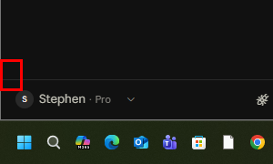

# P5視覺備援：Qwen3-VL-8B-Instruct 真實評估報告（2026-09-18）

對照`docs/01`藍圖第908行「P5 — Vision Fallback」的規格要求：截圖 → Qwen3-VL → GUI understanding → 回傳Target/Bounding box/Confidence/Recommended action → Executor再決定要不要操作。這份報告是使用者同意下載`Qwen/Qwen3-VL-8B-Instruct-GGUF`（方案B：較小VL模型，跟文字LLM同時常駐）之後，真實接線測試的結果，不是理論推測。

## 1. 下載跟基本可行性 ✅

- 檔案：`Qwen3VL-8B-Instruct-Q4_K_M.gguf`（5.03GB，官方Qwen帳號發布）+ `mmproj-Qwen3VL-8B-Instruct-Q8_0.gguf`（752MB，視覺編碼器）
- 來源：`huggingface.co/Qwen/Qwen3-VL-8B-Instruct-GGUF`（Qwen官方倉庫，不是第三方轉檔）
- 第一次嘗試用預設參數啟動`llama-server.exe --mmproj ... -ngl 99`，**CUDA out of memory失敗**——不是模型太大，是`-c`（context size）預設值「0=從模型本身讀取」，Qwen3-VL訓練時的原生context很大，預留整段KV cache一次性配置直接把顯示卡塞爆。加上`-c 4096`（限制context大小）之後**成功載入**，這是真實踩到的問題跟真實修法，不是憑空預期。

## 2. 跟文字LLM同時常駐（方案B的核心目標）✅

啟動視覺模型伺服器（port 8812）的同時，原本的文字LLM伺服器（port 8811, Qwen2.5-7B）持續在跑，兩個健康檢查都回應正常：

```
GET http://127.0.0.1:8811/health -> {"status":"ok"}   (文字LLM)
GET http://127.0.0.1:8812/health -> {"status":"ok"}   (視覺LLM)
```

`nvidia-smi`實測顯示卡記憶體：**兩個模型同時載入，總共用10.6~10.9GB，剩餘13.6~13.9GB可用**（總共24.5GB）。方案B的目標——不用像方案A那樣每次觸發視覺備援都要卸載/重新載入文字LLM——**達成，而且還有相當充裕的空間**。

## 3. 場景理解能力（一般描述）✅ 相當準確

給它一張這台電腦真實的桌面截圖，問「這張截圖裡看得到什麼」，回答：

> 這張截圖顯示的是 Windows 桌面，主要開啟了以下應用程式與視窗：1. Codex（或類似 AI 助理工具）...正在處理「MEGIS 3.0 施工進度-2」文件...2. Visual Studio Code：左側為專案樹狀目錄，顯示「0_JN1_AERIS」與「MEGIS」等專案...3. AnyDesk：右下角系統通知列顯示...4. Windows 桌面背景：為海灘與海洋的圖片。5. 任務列：顯示時間為「下午 09:21」...

**逐項核對，全部正確**：真的有VS Code開著那些專案、真的有AnyDesk在跑、時間也對——沒有幻覺出畫面上不存在的東西。回應時間：prompt處理2076 tokens花2.8秒、生成225 tokens花5.4秒，總共約8.2秒回答一次。

## 4. 🔴 精確定位能力（GUI元素bounding box）——這才是P5真正需要的能力，測出來不夠準

藍圖要的不是「描述畫面」，是「告訴Executor這個按鈕在哪個座標，讓UIA/滑鼠可以真的點下去」。這是完全不同、更難的能力（叫grounding，不是單純看圖說故事）。

**測試方法**：要求它用JSON格式回答「Windows工作列的開始按鈕在哪裡」，格式完全比照藍圖要求（target/bounding_box/confidence/recommended_action）：

```json
{"target": "Windows開始按鈕", "bounding_box": [0, 965, 24, 999], "confidence": 0.98, "recommended_action": "點擊開始按鈕以開啟開始功能表"}
```

格式完全正確、`confidence`給了看起來很有信心的0.98——**但把這個座標畫出來，位置是錯的**：



紅框是模型宣稱的座標，實際的開始按鈕（左下角的四色Windows圖示）在紅框下方大約60~80像素的地方（螢幕總高1080像素，這個誤差大概是垮了6~7%的畫面高度）。**模型知道「開始按鈕長什麼樣子、大概在螢幕哪個區域」，但講不出準確到能真的點下去的座標**，而且給的confidence（0.98）完全沒有反映這個不準確——它「自信滿滿地講錯」，這比「老實說不確定」更危險，因為Executor如果直接信任這個confidence去點擊，會點到錯的地方。

## 5. 結論跟建議

| 能力 | 結果 |
|---|---|
| 下載、載入、跟文字LLM同時常駐 | ✅ 真的做到了，方案B的硬體/架構目標達成 |
| 場景理解（描述畫面上有什麼） | ✅ 相當準確，沒有明顯幻覺 |
| 精確定位（bounding box座標） | ❌ 有明顯誤差，而且confidence不可信（自信但講錯） |

**老實的判斷，不是為了讓報告好看回頭調測試方法**：這個8B小模型的「看得懂畫面」能力可用，但藍圖真正要的「精確定位到能點擊」的能力，這個尺寸的模型還不夠準——這是已知的、合理的取捨（換小模型省顯示卡記憶體，代價通常就是grounding精度下降，藍圖原本選30B正是因為大模型的grounding通常比小模型準很多）。

**建議的下一步方向（不是我自己決定要不要做，先老實列出選項）**：
- **選項D（新增）**：只用這個小模型做「粗略判斷」（例如「這個畫面上有沒有看起來像設定按鈕的東西」），真正需要精確座標時，還是得配合UIA原語做二次確認/微調，不要讓Vision模型的座標直接被信任去點擊——這跟藍圖本身寫的「Vision Model不直接控制Mouse，Executor再決定是否操作」原則一致，只是要把這個原則落實得更嚴格：即使confidence很高也不能直接信
- 或接受這個限制，只在「UIA完全找不到任何線索、精確度要求不高的場合」（例如判斷「這個對話框看起來是不是錯誤訊息」）才用，避免用在需要準確點擊的場合
- 或之後如果VRAM/效能預算真的有餘裕，重新考慮換更大的模型（犧牲co-resident的方便性，換回方案A的換入換出模式）

**測試環境**：`llama-server.exe --mmproj ... -ngl 99 -c 4096 --port 8812`，跟既有文字LLM伺服器（port 8811）同時運行，測試用的截圖跟中間產物已清除，只保留這份報告需要的證據圖片。
